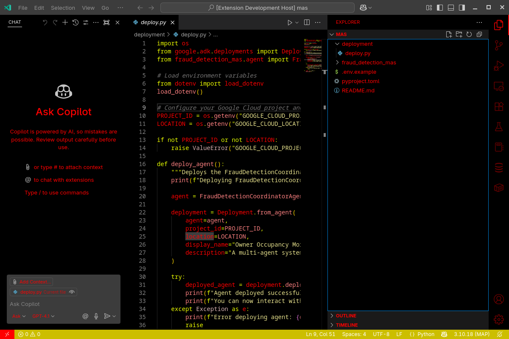

# Chud theme for [Visual Studio Code](http://code.visualstudio.com)

> A dark theme for [Visual Studio Code](http://code.visualstudio.com).

## Install

Install the extension at [Chud theme](https://marketplace.visualstudio.com/items?itemName=jeffstein.chud-theme).

## Team

This theme is maintained by the following person(s) and a bunch of [awesome contributors](https://github.com/BM-AI-solutions/chud-theme/graphs/contributors).

 |
:---: |
[Menacing American Patriot](https://github.com/BM-AI-solutions) |

## Community

* [iFunny](https://ifunny.co/user/Jeffstein) - Best for getting updates about themes and new stuff.
* [GitHub](https://github.com/BM-AI-solutions/chud-theme/discussions) - Best for asking questions and discussing issues.
* [Discord](https://discord.gg/MAPg9eV9Ed) - Best for hanging out with the community.

## Contributing

If you'd like to contribute to this theme, please read the [contributing guidelines](./.github/CONTRIBUTING.md).

## License

[Apache 2.0 License](./LICENSE)